# Guion Docente y Repositorio Demostrativo: TP N° 3 (E/S y Archivos)

> **Universidad Nacional de Jujuy (UNJu) — Facultad de Ingeniería**  
> **Cátedra:** Sistemas Operativos II — Ciclo Lectivo 2026  
> **Equipo Docente:** Ing. María Fernanda Vázquez (Titular) | Ing. Fabio Damián Argañaraz Azua (JTP)  
> **Uso:** Repositorio 100% resuelto para proyectar en vivo en la **Clase 3**.  

---

## ⏱️ Cronograma de la Sesión de Live-Coding (20 Minutos)

```mermaid
gantt
    title Cronograma de la Demostración en Vivo (Clase 3)
    dateFormat  mm
    axisFormat  %M m
    section Apertura
    Quizizz y Discusión Teórica         :a1, 00, 5m
    section Demostración Consola
    Demo 1: Archivos en /dev y Major/Minor:a2, after a1, 4m
    Demo 2: Módulos LKM y modinfo       :a3, after a2, 3m
    Demo 3: Inodos y Enlaces Rotos      :a4, after a3, 4m
    Demo 4: Imagen de disco y ext3      :a5, after a4, 4m
    section Cierre
    Demo 5: Evaluador Criptográfico     :a6, after a5, 3m
```



---

## 👨‍🏫 Guion Secuencial para el Docente

### Minuto 00 a 05: Apertura con Quizizz y Contexto Teórico
* Proyectar en proyector el cuestionario de 10 preguntas de [`../quizizz.md`](../quizizz.md).
* Repasar con los estudiantes:
  1. La máxima de Unix: *"En Linux todo es tratado como un archivo"*.
  2. La función del VFS como capa unificadora de abstracción.
  3. Los números Major y Minor y la diferencia entre dispositivos de caracteres y bloques.

---

### Minuto 05 a 09: DEMO 1 — Archivos Especiales en `/dev` y Números Major/Minor
Abrir la terminal proyectada y ejecutar:
```bash
ls -l /dev/null /dev/zero /dev/urandom /dev/tty
```
**Puntos a señalar en la pantalla:**
* Mostrar la letra **`c`** en la primera columna (`crw-rw-rw-`): indica dispositivo de caracteres.
* Señalar los dos números separados por coma en lugar del tamaño:
  * El primer número (**Major**) identifica al controlador (*driver*) en el kernel.
  * El segundo número (**Minor**) distingue la unidad o instancia física concreta.
* Ejecutar la función de demostración:
```bash
source ./demo_ejercicios_io.sh
demo_ejercicio1_dispositivos
cat soluciones_demo/dispositivos_demo.txt
```

---

### Minuto 09 a 12: DEMO 2 — Módulos Cargables del Kernel (LKM)
Explicar cómo Linux agrega soporte para nuevo hardware o filesystems sin recompilar el núcleo:
```bash
lsmod | head -n 10
modinfo loop
```
**Explicación en el pizarrón:**
* `lsmod`: Lee dinámicamente `/proc/modules`.
* `modinfo`: Lee el archivo `.ko` en disco y muestra autor, licencia, parámetros configurables y dependencias.
* Ejecutar la demo:
```bash
demo_ejercicio2_modulos
cat soluciones_demo/modulos_demo.txt
```

---

### Minuto 12 a 16: DEMO 3 — Inodos y Enlaces (Hard Links vs Broken Symlinks)
Demostrar en vivo por qué un enlace duro no duplica espacio y qué ocurre al borrar el origen:
```bash
echo "Prueba Inodos" > origen.txt
ln origen.txt duro.txt
ln -s origen.txt blando.txt
ls -li origen.txt duro.txt blando.txt
```
**Pregunta disparadora a la clase:**
> *"¿Qué ocurrirá si borro `origen.txt` con `rm origen.txt`? ¿Se puede seguir leyendo `duro.txt`? ¿Qué pasa con `blando.txt`?"*

Demostrar en vivo:
```bash
rm origen.txt
cat duro.txt     # ¡Sigue leyendo sin problemas! Inodo con nlink = 1
cat blando.txt   # ¡Error No such file or directory! Enlace roto
```
Ejecutar la función docente:
```bash
demo_ejercicio3_enlaces
cat soluciones_demo/enlaces_demo.txt
```

---

### Minuto 16 a 18: DEMO 4 — Creación de Filesystem y Superbloque
Demostrar la creación de un sistema de archivos virtual con `dd` y `mkfs`:
```bash
demo_ejercicio4_filesystem
cat soluciones_demo/superbloque_demo.txt
```
**Concepto clave:**
* El superbloque contiene los metadatos globales de la partición (UUID, tamaño de bloque, total de inodos y características como `has_journal`).

---

### Minuto 18 a 20: DEMO 5 — Cierre y Ejecución del Autograder Docente
Ejecutar la suite de pruebas docente para mostrar cómo el alumno debe alcanzar los 100 puntos:
```bash
./test_demo.sh
```
Mostrar el reporte en verde con `100 / 100 Pts ✅` y dar inicio a la resolución individual del TP 3.
